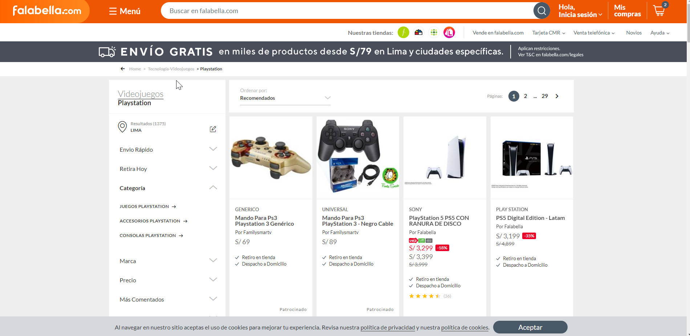
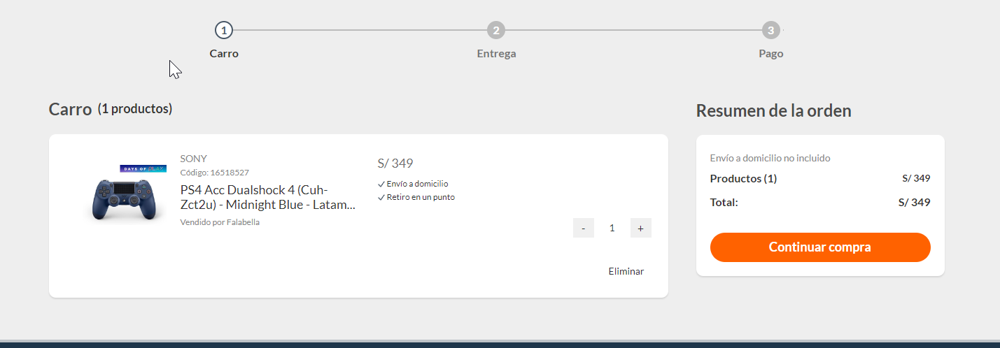
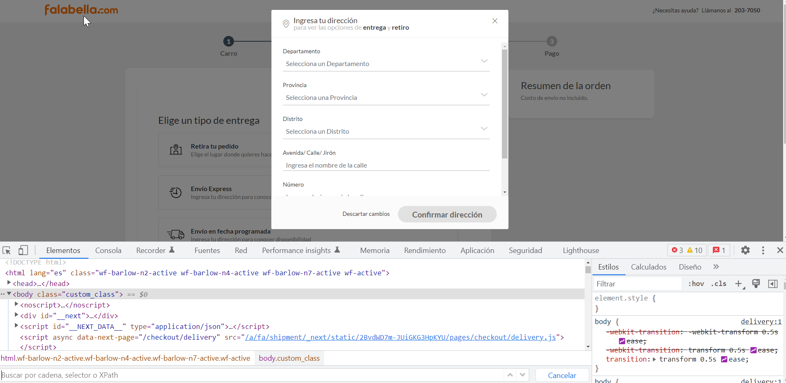
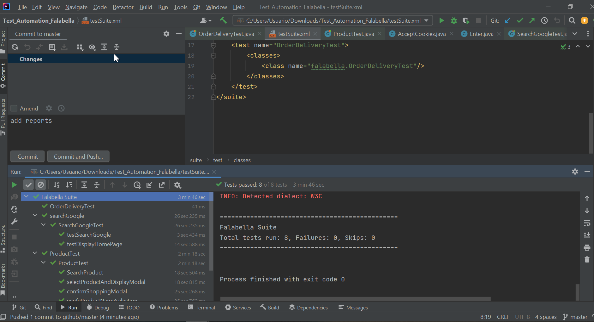

# 🚀 Proyecto de Módulo Test Automation Falabella 

> Se debe automatizar la compra de un artículo con garantía extendida.
>
> En google buscar la palabra “falabella” y del listado que aparece, presionar en el ítem que aparezca para entrar al ecommerce de Colombia.
>Dentro de la tienda, buscar algún producto, por ejemplo “ps4". Luego presionar en el producto para ver la nueva página con el detalle. Finalmente agregarlo a la “Bolsa” de productos
>
>Ir a la “Bolsa” de compras, aumentar a 2 productos para comprar, agregar “Garantía Extendida” y luego presionar el botón “Ir a Comprar”.
>
>Validar el producto el valor en la página de despacho y el resumen del producto
>
>Elegir método de pago giftCard y validar el mensaje final

# 👨‍💻 Stack Tecnológico

Para el presente proyecto se utilizó:

* [The Screenplay Pattern](https://serenity-js.org/handbook/design/screenplay-pattern.html)
* [Selenium automates browsers](https://www.selenium.dev/)
* [TestNG testing framework](https://testng.org/doc/)
* [Extent Reports in Selenium](https://mvnrepository.com/artifact/com.relevantcodes/extentreports)
* [Apache Maven](https://maven.apache.org/)

# 👨‍💻 Herramientas

Se utilizó:

* [IntelliJ IDEA Community](https://www.jetbrains.com/)
* [Google Chrome](https://www.google.com/intl/es/chrome/)

# 📒 Informe

El informe del proyecto se encuentra en la carpeta documentation dentro del repositorio con nombre TRABAJO FINAL.docx.

## ✍ Autores

* Never Adrian Sossa
* Noemi Rosario Ancari Villcarani

 
