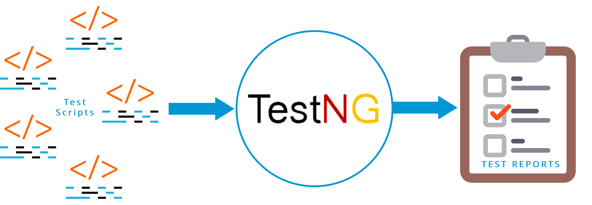

# Test_Automation_Falabella
Test Automation Falabella
•	En google buscar la palabra “falabella” y del listado que aparece, presionar en el ítem que aparezca para entrar al ecommerce de Colombia.
•	Dentro de la tienda, buscar algún producto, por ejemplo “ps4". Luego presionar en el producto para ver la nueva página con el detalle. Finalmente agregarlo a la “Bolsa” de productos
•	Ir a la “Bolsa” de compras, aumentar a 2 productos para comprar, agregar “Garantía Extendida” y luego presionar el botón “Ir a Comprar”.
•	Validar el producto el valor en la página de despacho y el resumen del producto
•	Elegir método de pago giftCard y validar el mensaje final

asfasf